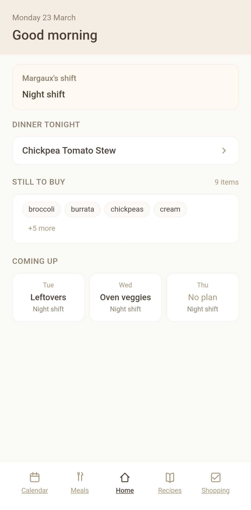
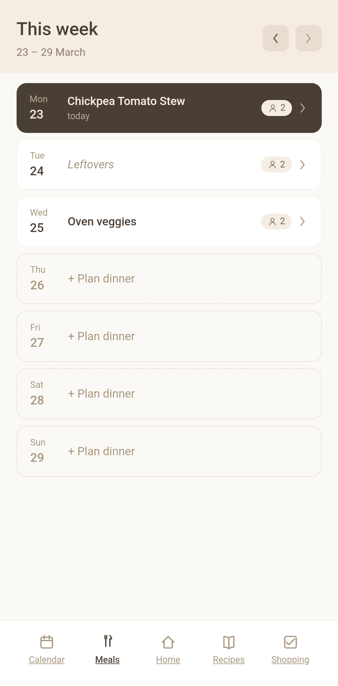

# OurHome

A household management PWA built for two people. It covers meal planning with a shared recipe book, a collaborative shopping list, a calendar that syncs work shifts from an ICS feed, and live room temperature and humidity — all accessible from any device on the home network.

<p align="center">
  
  
</p>

## Stack

- **Backend** — FastAPI + SQLite (aiosqlite), runs on a Raspberry Pi
- **Frontend** — React + Vite + TypeScript PWA

---

## Raspberry Pi deployment

The backend is published as a Docker image (ARM64) via GitHub Actions on every push to `main`.

### Pull and run

```bash
docker pull ghcr.io/maxthfe/household-app/backend:latest

docker run -d \
  --name ourhome \
  --restart unless-stopped \
  -p 8000:8000 \
  -v /home/pi/ourhome/data:/app/data \
  -e HT_USER1_NAME=UserName1 \
  -e HT_USER2_NAME=UserName2 \
  -e HT_ICS_URL=<your-ics-url> \
  -e HT_ICS_SYNC_INTERVAL_MINUTES=30 \
  ghcr.io/maxthfe/household-app/backend:latest
```

The SQLite database is persisted at `/home/pi/ourhome/data` on the host.

### Update to latest

```bash
docker pull ghcr.io/maxthfe/household-app/backend:latest
docker restart ourhome
```

---

## Room sensors

The home screen shows temperature and humidity from Bluetooth sensors
broadcasting unencrypted BTHome v2 (service UUID `0xFCD2`). The Pi only listens
— no pairing or cloud account. Tapping the Rooms section charts the history.

Readings are sampled once a minute into `data/sensors.db`, separate from the app
database and kept indefinitely (~60 MB/year), so the raw rows stay queryable
with `sqlite3` directly.

Set one MAC per room in `backend/.env`; a room left blank is not shown:

```bash
HT_SENSOR_LIVING_ROOM_MAC=AA:BB:CC:DD:EE:01
HT_SENSOR_BEDROOM_MAC=AA:BB:CC:DD:EE:02
HT_SENSOR_KITCHEN_MAC=AA:BB:CC:DD:EE:03
```

Requires Bluetooth enabled on the host (`sudo rfkill unblock bluetooth`); the
container reaches BlueZ via the `/run/dbus` mount in `docker-compose.yml`.

---

## Local development

### Backend

```bash
cd backend
uv sync
uv run uvicorn app.main:app --reload
```

Runs at `http://localhost:8000`. Copy `.env.example` to `.env` and fill in your values.

### Frontend

```bash
cd frontend
npm install
npm run dev
```

Runs at `http://localhost:5173`.

---

## GitHub Actions

On push to `main` (backend files only), a Docker image is built for `linux/arm64` and pushed to the GitHub Container Registry (`ghcr.io`).

---

## License

[MIT](LICENSE)
